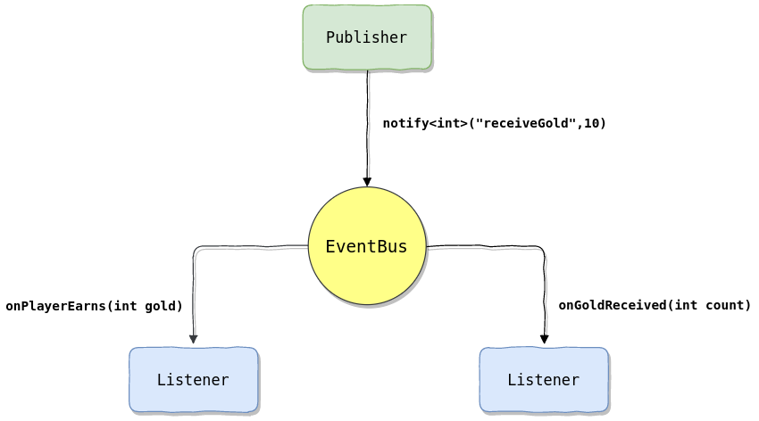

# EventBus
Simple and very fast event bus.
The EventBus library is a convenient realization of the observer pattern.
It works perfectly to supplement the implementation of MVC logic (model-view-controller) in event-driven UIs





EventBus was created because I want something easy to use and faster than [CCNotificationCenter](https://github.com/cocos2d/cocos2d-x/blob/v2/cocos2dx/support/CCNotificationCenter.h)
from [cocos2d-x](https://github.com/cocos2d/cocos2d-x) library. Of course C++11 support was mandatory.


EventBus is:
- Fast
- Easy to use
- Strong typed
- Free
- Decouples notification senders and receivers

# Usage

Notify by Event object
```cpp
Dexode::EventBus bus;
Dexode::Event<int> simpleEvent{"simple"};
//...
bus.notify(simpleEvent, 2);//Everyone who listens will receive this notification.
```

Notify without Event object
```cpp
Dexode::EventBus bus;
//...
bus.notify<int>("simple", 2);//Everyone who listens will receive this notification.
```

Lambda listener
```cpp
Dexode::EventBus bus;
//...
int token = bus.listen<int>("simple", [](int value) // register listener
{
});
//If we want unlisten exact listener we can use token for it
bus.unlistenAll(token);
```

Listener is identified by `token`. Token is returned from EventBus::listen methods.
We can register multiple listeners on one token.
```cpp
Dexode::EventBus bus;
Dexode::Event<int> event{"simple"};
//...
int token = bus.listen(event, [](int value) // register listener
{
});

bus.listen(token, event, [](int value) // another listener
{
});

bus.unlistenAll(token);//Now those two lambdas will be removed from listeners
``` 

If you don't want handle manually with `token` you can use `EventCollector` class.
It is useful when we want have multiple listen in one class. So above example could look like this:

```cpp
Dexode::EventBus bus;
Dexode::Event<int> event{"simple"};
Dexode::EventCollector collector{&bus};
//...
collector.listen(event, [](int value) // register listener
{
});

collector.listen(event, [](int value) // another listener
{
});

collector.unlistenAll();//Now those two lambdas will be removed from listeners
```

```cpp
class Example
{
public:
	Example(Dexode::EventBus& bus)
			: _collector{&bus}
	{
		_collector.listen<int>("event1", std::bind(&Example::onEvent1, this, std::placeholders::_1));
		_collector.listen<std::string>("event2", std::bind(&Example::onEvent2, this, std::placeholders::_1));
	}

	void onEvent1(int value)
	{
	}

	void onEvent2(std::string value)
	{
	}

private:
	Dexode::EventCollector _collector;// use RAII
};

//EventCollector sample
Dexode::EventBus bus;
Example ex{bus};
//...
bus.notify<int>("event1", 2);
```

# Add to your project

EventBus can be added as `ADD_SUBDIRECTORY` to your cmake file.
Then simply link it via `TARGET_LINK_LIBRARIES`  
Example:
```
ADD_SUBDIRECTORY(lib/EventBus)
ADD_EXECUTABLE(MyExecutable
		main.cpp
		)

SET_TARGET_PROPERTIES(MyExecutable PROPERTIES
		CXX_STANDARD 14
		CXX_STANDARD_REQUIRED YES
		)

TARGET_LINK_LIBRARIES(MyExecutable PUBLIC Dexode::EventBus)
```

Also if you want you can install library and add it any other way you want.


# Performance
I have prepared some performance results. You can read about them [here](performance/README.md)  
Small example:

```
check10NotificationsFor1kListeners                                     273 ns        273 ns    2609987 sum=-1.81219G
check10NotificationsFor1kListeners_EventBus2                           267 ns        267 ns    2652159 sum=-1.77676G
check10NotificationsFor1kListeners_CCNotificationCenter              11172 ns      11171 ns      62865 sum=54.023M
```

# Thanks to

- [stanislawkabacinski](https://github.com/stanislawkabacinski) for fixing windows ;) [53d5026](https://github.com/gelldur/EventBus/commit/53d5026cad24810e82cd8d4a43d58cbfe329c502)
- [kuhar](https://github.com/kuhar) for his advice and suggestions for EventBus
- [ruslo](https://github.com/ruslo) for this great example: https://github.com/forexample/package-example

# License

EventBus source code can be used according to the Apache License, Version 2.0.  
For more information see [LICENSE](LICENSE) file
